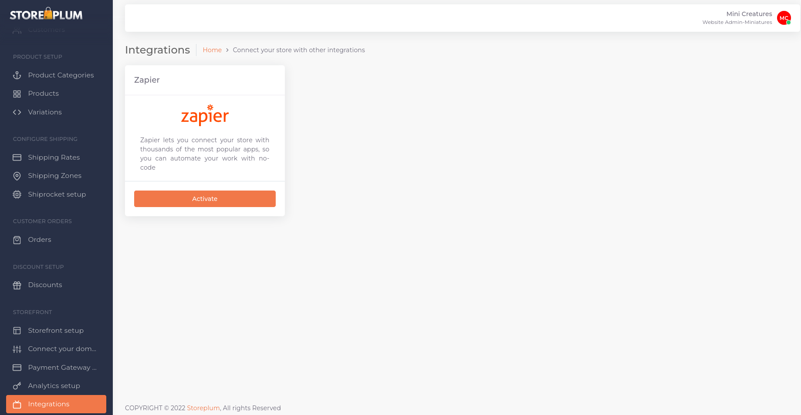

# Overview

The purpose of this documentation is to understand the list of available Storeplum APIs and their corresponding requests and response for a seamless Zapier integration of Storeplum with your app. Storeplum API 1.0 allows data to be created, read and updated using requests in JSON format and using standard REST HTTP methods which are understood by most of the HTTP clients.

The current Storeplum REST API integration version is `v1` which takes a first-order position in endpoints. 

The documentation language binding is in Shell. You can view code examples in the dark area to the right, and you can switch the programming language of the examples with the tabs in the top right.

## Request/Response Format

The default response format is JSON. Requests with a responseMessage-body use plain JSON to set or update resource attributes. Successful requests will return a `200 OK HTTP` status.

Some general information about responses:

1. Resource IDs are returned as integers.
2. Any decimal monetary amount, such as prices or totals, will be returned as **String**s with two decimal places. 
3. Other amounts, such as item counts, are returned as integers. 
4. Blank fields are generally included as null or emtpy **String** instead of being omitted.


# Authentication

Each incoming request from Zapier to Storeplum API has to be authenticated using pre-generated keys. Storeplum uses pre-generated API keys for Zapier integration which can be obtained in [Storeplum Dashboard](https://dashboard.storeplum.in/) under integrations section. 

Click on Zapier to activate your Zapier integration with Storeplum. Once activated, copy the API key seen on the screen. Please make sure to save this key as it won't be available to view later.





> To authorize, use this code:


<!-- ```java
import okhttp3.*;

Request request = new Request.Builder()
                .url(url)
                .post(body)
                .addHeader("X-SP-INTEGRATION", <YOUR-API-KEY>)
                .build();
Response response = okHttpClient.newCall(request).execute();
``` -->

```shell
# With shell, you can just pass the correct header with each request
curl "api_endpoint_here" \
  -H "X-SP-INTEGRATION: <YOUR-API-KEY>"
```

<!-- ```javascript
const kittn = require('kittn');

let api = kittn.authorize('meowmeowmeow');
``` -->

> Make sure to replace the value for header `x-sp-integration` with your API key.

Storeplum uses the above API key to allow access to the APIs. Include this API key in all requests to Storeplum API in a header with name `X-SP-INTEGRATION`

`X-SP-INTEGRATION: <YOUR-API-KEY>`

<!-- <aside class="notice">
You must replace <code>YOUR-API-KEY</code> with your personal API key.
</aside> -->

# Products

Product entity is the crux of every online store built on Storeplum. Products can be added manually through Storeplum dashboard or through external API integration services like Zapier and others.

**Product States**

Following are the various states of a `Product`

Status | Description
------ | -----------
`UPCOMING` | When a new product is added in a Storeplum account, it's default state is `UPCOMING`. From here, the Product can move to either `ACTIVE` or `INACTIVE` state. Products with status `UPCOMING` are not visible on the online store.
`ACTIVE` | A product can be marked as `ACTIVE` only when all of it's attributes are added and relevant product images are uploaded. `ACTIVE` products are visible on the online store.
`INACTIVE` | A product can be marked as `INACTIVE` when a user no longer wants it to be visible on their online store. In certain cases like no inventory, A product moves to `INACTIVE` state by default. An inactive product can be moved back to be active through Storeplum dashboard.


## Create Product

```shell

curl "https://api.storeplum.in/giclee-admin-service/admin/integration/zapier/action/product/save" \
  -H "Content-Type: application/json"\
  -H "X-SP-INTEGRATION: <YOUR-API-KEY>"\
  -d '{
    "customerCode": "your-storeplum-customer-code",
    "productName": "Product name",
    "productDescription": "Product description",
    "productSEOTag": "product-seo-tag",
    "productCategoryID": 99,
    "originalPrice": 123.45,
    "basePrice": 123.45,
    "configDefaultDraftName": "Product default configuration name",
    "productionTimeEstimate": 7,
    "taxRate": 12.5,
    "isTaxInclusive": true,
    "skuCount": 1200
  }'

```
> Successful Response `200 OK`

```json
{
  "isSuccess": true,
  "responseMessage": "success",
  "object": {
    "product" : {
      "productID": 123
    }
  }
}
```

> Failed Response `400 BAD REQUEST`

```json
{
  "isSuccess": false,
  "responseMessage": "Invalid input",
  "object": {}
  
}
```

In order to add a product through API, you'll need to use the API integration key from the dashboard and make the below request-

### HTTP Request

`POST https://api.storeplum.in/giclee-admin-service/admin/integration/zapier/action/product/save`

### HTTP Headers

`X-SP-INTEGRATION: <YOUR-API-KEY>`

### Body Parameters

Parameter | Type | Description
--------- | ---- | -----------
customerCode | **String** | Storeplum Customer Code which can be found in your Storeplum Dashboard.
productName | **String** | Name of the product
productDescripion | **String** | Description of the product. Seen on product landing page.
productSEOTag | **String** | A unique SEO friendly slug for product page. Please note that two different products cannot have the same slug. 
productCategoryID | **Number** | Product category ID reflecting the Category to which this product belongs to. A `New Product Event` from platform returns the productCategoryID for that product.
originalPrice | **Number** | Product selling price on the website.
basePrice | **Number** | Defaults to original product price. Discounted price cannot be greater than original price. This price is shown next to the striked off value of the original product price on the website.
configDefaultDraftName | **String** | Default draft name for this product. Draft name can be same as product name.
productionTimeEstimate | **Integer** | Add an estimated time in days to ship this product from your warehouse.
taxRate | **Number** | Tax rate in percentage associated with the product.
isTaxInclusive | **Integer** | Is tax inclusive in product base price? Enter 1 if tax is inclusive with product price, 0 otherwise.
skuCount | **Integer** | Default number of stock keeping units for this product.


# Webhooks

Storeplum API allows you to listen to various platform events through webhooks. Simply add register your webhook url for a specific event that you'd like to listen to and Storeplum will send you a push notification as soon as the event is triggered. 

The following events are currently supported by platform-

1. New Customer Event
2. New Product Event
3. New Order Event
4. Order Shipped Event

<aside class="warning">You can only register a HTTPS url as a webhook. All HTTP urls will be ignored by default.</aside>


## New Customer Event

Add your webhook url to start listening to new customer event. This event is triggered whenever a new customer is added to your Storeplum account.

<!-- ```java
import okhttp3.*;

Map<**String**, Object> data = new HashMap<>();
data.put("hookUrl", "<your-webhook-url>");
data.put("customerCode", "your-storeplum-customer-code");

RequestBody body = RequestBody.create(new Gson().toJson(data),
                MediaType.parse("application/json"));

Request request = new Request.Builder()
                .url("https://api.storeplum.in/giclee-admin-service/admin/integration/zapier/new_customer/subscribe")
                .post(body)
                .addHeader("X-SP-INTEGRATION", <YOUR-API-KEY>)
                .build();
Response response = okHttpClient.newCall(request).execute();
``` -->

```shell
curl "https://api.storeplum.in/giclee-admin-service/admin/integration/zapier/new_customer/subscribe" \
  -H "X-SP-INTEGRATION: <YOUR-API-KEY>"\
  -d '{
    hookUrl: "<your-webhook-url>",
    customerCode: "your-storeplum-customer-code"
  }'
```

<!-- ```javascript
const kittn = require('kittn');

let api = kittn.authorize('meowmeowmeow');
let kittens = api.kittens.get();
``` -->

> Success Response `200 OK`

```json
{
  "isSuccess": true,
  "responseMessage": "success",
  "object": {
    "uniqueID" : "subscription-id-for-this-webhook"
  }
}
```
> Failed Response `400 BAD REQUEST`

```json
{
  "isSuccess": false,
  "responseMessage": "invalid_input",
  "object": {}
  
}
```

### HTTP Request

`POST https://api.storeplum.in/giclee-admin-service/admin/integration/zapier/new_customer/subscribe`

### Body Parameters

Parameter | Type | Description
--------- | ---- | -----------
hookUrl | **String** | Your webhook url where you'd like to listen for this event.
customerCode | **String** | Storeplum Customer Code which can be found in your Storeplum Dashboard.

## Add New Product Event

Add your webhook url to start listening to add new product event. This event is triggered whenever a new product is added to your Storeplum account.

<!-- ```java
import okhttp3.*;

Map<**String**, Object> data = new HashMap<>();
data.put("hookUrl", "<your-webhook-url>");
data.put("customerCode", "your-storeplum-customer-code");

RequestBody body = RequestBody.create(new Gson().toJson(data),
                MediaType.parse("application/json"));

Request request = new Request.Builder()
                .url("https://api.storeplum.in/giclee-admin-service/admin/integration/zapier/new_product/subscribe")
                .post(body)
                .addHeader("X-SP-INTEGRATION", <YOUR-API-KEY>)
                .build();
Response response = okHttpClient.newCall(request).execute();
``` -->

```shell
curl "https://api.storeplum.in/giclee-admin-service/admin/integration/zapier/new_product/subscribe" \
  -H "X-SP-INTEGRATION: <YOUR-API-KEY>"\
  -d '{
    hookUrl: "<your-webhook-url>",
    customerCode: "your-storeplum-customer-code"
  }'
```

<!-- ```javascript
const kittn = require('kittn');

let api = kittn.authorize('meowmeowmeow');
let kittens = api.kittens.get();
``` -->

> Success Response `200 OK`

```json
{
  "isSuccess": true,
  "responseMessage": "success",
  "object": {
    "uniqueID" : "subscription-id-for-this-webhook"
  }
}
```
> Failed Response `400 BAD REQUEST`

```json
{
  "isSuccess": false,
  "responseMessage": "invalid_input",
  "object": {}
  
}
```

### HTTP Request

`POST https://api.storeplum.in/giclee-admin-service/admin/integration/zapier/new_product/subscribe`

### Body Parameters

Parameter | Type | Description
--------- | ---- | -----------
hookUrl | **String** | Your webhook url where you'd like to listen for this event.
customerCode | **String** | Storeplum Customer Code which can be found in your Storeplum Dashboard.


## Order Shipped Event

Add your webhook url to start listening to order shipped event. This event is triggered whenever a order is marked as `Shipped` in your Storeplum account.

<!-- ```java
import okhttp3.*;

Map<**String**, Object> data = new HashMap<>();
data.put("hookUrl", "<your-webhook-url>");
data.put("customerCode", "your-storeplum-customer-code");

RequestBody body = RequestBody.create(new Gson().toJson(data),
                MediaType.parse("application/json"));

Request request = new Request.Builder()
                .url("https://api.storeplum.in/giclee-admin-service/admin/integration/zapier/order_shipped/subscribe")
                .post(body)
                .addHeader("X-SP-INTEGRATION", <YOUR-API-KEY>)
                .build();
Response response = okHttpClient.newCall(request).execute();
``` -->

```shell
curl "https://api.storeplum.in/giclee-admin-service/admin/integration/zapier/order_shipped/subscribe" \
  -H "X-SP-INTEGRATION: <YOUR-API-KEY>"\
  -d '{
    hookUrl: "<your-webhook-url>",
    customerCode: "your-storeplum-customer-code"
  }'
```

<!-- ```javascript
const kittn = require('kittn');

let api = kittn.authorize('meowmeowmeow');
let kittens = api.kittens.get();
``` -->

> Success Response `200 OK`

```json
{
  "isSuccess": true,
  "responseMessage": "success",
  "object": {
    "uniqueID" : "subscription-id-for-this-webhook"
  }
}
```
> Failed Response `400 BAD REQUEST`

```json
{
  "isSuccess": false,
  "responseMessage": "invalid_input",
  "object": {}
  
}
```

### HTTP Request

`POST https://api.storeplum.in/giclee-admin-service/admin/integration/zapier/order_shipped/subscribe`

### Body Parameters

Parameter | Type | Description
--------- | ---- | -----------
hookUrl | **String** | Your webhook url where you'd like to listen for this event.
customerCode | **String** | Storeplum Customer Code which can be found in your Storeplum Dashboard.


## New Order Event

Add your webhook url to start listening to add new order event. This event is triggered whenever a new order is added to your Storeplum account.

<!-- ```java
import okhttp3.*;

Map<**String**, Object> data = new HashMap<>();
data.put("hookUrl", "<your-webhook-url>");
data.put("customerCode", "your-storeplum-customer-code");

RequestBody body = RequestBody.create(new Gson().toJson(data),
                MediaType.parse("application/json"));

Request request = new Request.Builder()
                .url("https://api.storeplum.in/giclee-admin-service/admin/integration/zapier/new_order/subscribe")
                .post(body)
                .addHeader("X-SP-INTEGRATION", <YOUR-API-KEY>)
                .build();
Response response = okHttpClient.newCall(request).execute();
``` -->

```shell
curl "https://api.storeplum.in/giclee-admin-service/admin/integration/zapier/new_order/subscribe" \
  -H "X-SP-INTEGRATION: <YOUR-API-KEY>"\
  -d '{
    hookUrl: "<your-webhook-url>",
    customerCode: "your-storeplum-customer-code"
  }'
```
<!-- 
```javascript
const kittn = require('kittn');

let api = kittn.authorize('meowmeowmeow');
let kittens = api.kittens.get();
``` -->

> Success Response `200 OK`

```json
{
  "isSuccess": true,
  "responseMessage": "success",
  "object": {
    "uniqueID" : "subscription-id-for-this-webhook"
  }
}
```
> Failed Response `400 BAD REQUEST`

```json
{
  "isSuccess": false,
  "responseMessage": "invalid_input",
  "object": {}
  
}
```

### HTTP Request

`POST https://api.storeplum.in/giclee-admin-service/admin/integration/zapier/new_order/subscribe`

### Body Parameters

Parameter | Type | Description
--------- | ---- | -----------
hookUrl | **String** | Your webhook url where you'd like to listen for this event.
customerCode | **String** | Storeplum Customer Code which can be found in your Storeplum Dashboard.


